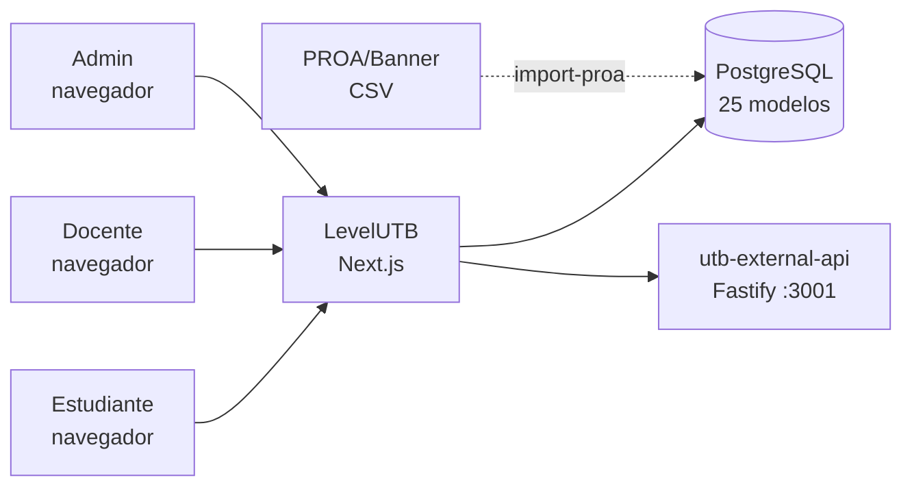
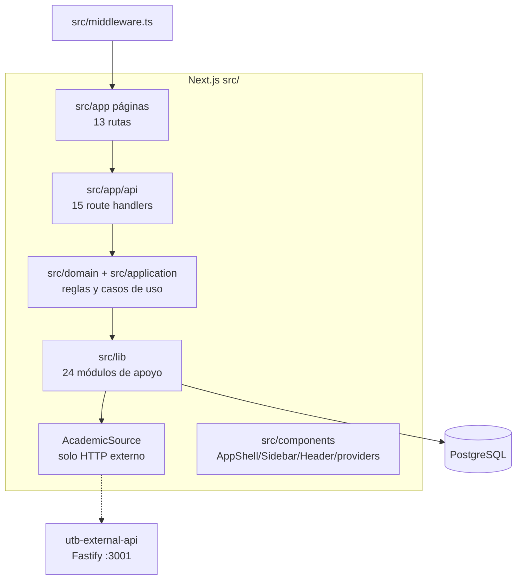
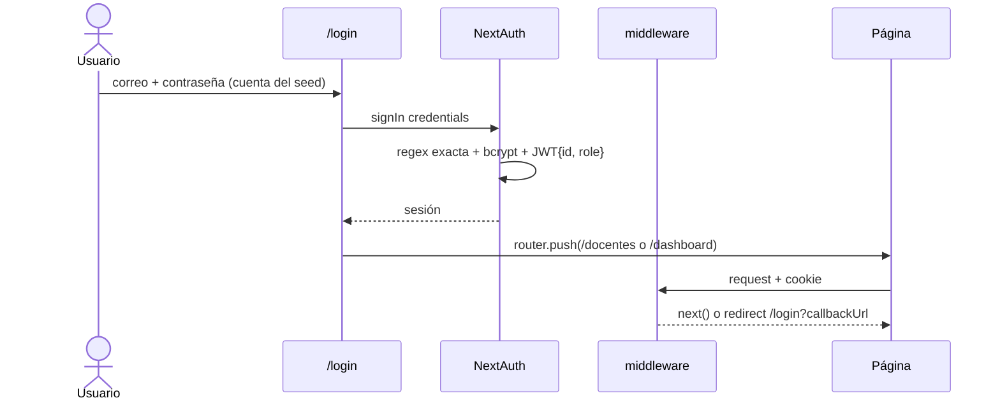
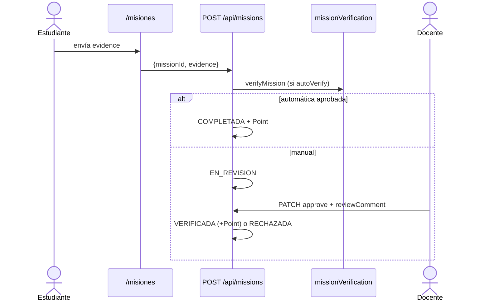
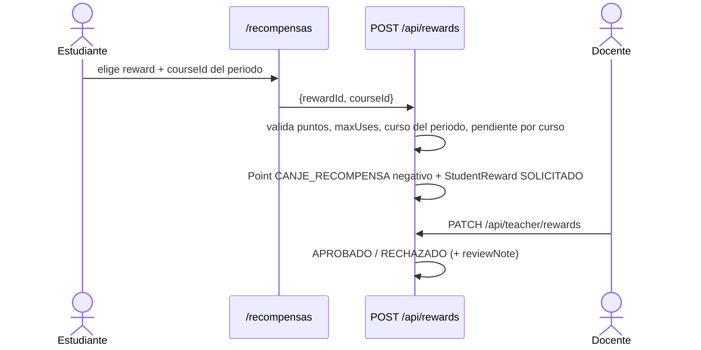
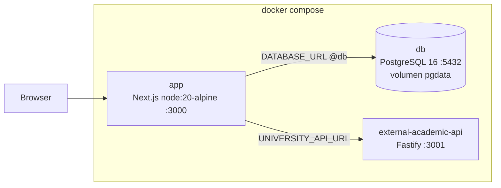

# LevelUTB — Documentación de Arquitectura (arc42)

> Fuente de verdad del código: `README.md` (funcionalidad y operación) y `docs/README.md` (índice de documentación).
> Stack: Next.js 16.3.2 (App Router) · React 19 · Tailwind CSS 4 · PostgreSQL + Prisma 7.9.1 · NextAuth 5 beta.
> Estado: prototipo. El único acceso posible es con las cuentas de demostración creadas por el seed; no hay alta de cuentas ni registro de estudiantes. Ver la sección 11 para fallas corregidas, deuda pendiente y supuestos abiertos.

---

## 1. Introducción y metas

### Propósito

Plataforma web gamificada para que el estudiante de la Universidad Tecnológica de Bolívar visualice su avance en la malla curricular, gane puntos e insignias, canjee recompensas académicas y reciba recomendaciones personalizadas. El docente acompaña por curso, verifica misiones, aprueba canjes y envía rutas recomendadas.

> **Alcance del prototipo**: el acceso hoy es únicamente con las cuentas de demostración del seed. El login valida que el correo pertenezca al dominio institucional, pero no hay alta de cuentas: un estudiante real todavía no puede crear su cuenta ni iniciar sesión. Ver la sección 11.2.

### Stakeholders

| Rol | Interés |
|---|---|
| Estudiante | Ver progreso, misiones, insignias, recompensas, estadísticas y perfil. Hoy solo con la cuenta demo del seed |
| Docente | Acompañar estudiantes, revisar misiones y canjes, consultar insignias (`/docentes`, `/docentes/insignias`, `/perfil-docente`). Alta solo por ADMIN, sin auto-registro |
| ADMIN | Crear cuentas docente vía `POST /api/admin/teachers`. Bootstrap pendiente (ver la sección 11) |
| UTB (institución) | Seguimiento académico, alertas de riesgo, fuente institucional vía `utb-external-api` + `scripts/import-proa.ts` |
| Equipo de desarrollo | Monolito Next.js simple de operar: un deploy + PostgreSQL |

### Metas de calidad (priorizadas)

1. **Usabilidad por rol**: navegación distinta estudiante/docente (`Sidebar.tsx`, `Header.tsx`), responsive y modo claro/oscuro. Login con correo y contraseña, con las credenciales demo visibles en la propia pantalla.
2. **Seguridad**: dominio `@utb.edu.co` con regex exacta (`institutionalEmail.ts`), bcrypt para contraseñas, política de contraseña en el alta docente, y autorización por rol en cada endpoint.
3. **Mantenibilidad**: dominio aislado en `src/domain/*` (reglas puras) y `src/lib/*` (24 módulos de soporte), 25 modelos Prisma como contrato de datos, 62 tests unitarios.
4. **Resiliencia externa**: con `UNIVERSITY_API_ENABLED="true"` y la API externa caída, las rutas académicas responden `503` en vez de servir datos parciales.
5. **Integridad académica**: inscripciones `MANUAL` del estudiante no contaminan promedio ni misión `APROBAR_CREDITOS_SEMESTRE` (mitigación parcial, ver la sección 11).

---

## 2. Restricciones

| Tipo | Restricción | Origen |
|---|---|---|
| Framework | Next.js 16.3.2 App Router, React 19 | `package.json` |
| UI | Tailwind CSS 4 (`globals.css`, `postcss.config.mjs`) | `package.json` |
| Datos | PostgreSQL + Prisma 7.9.1 con `@prisma/adapter-pg` | `prisma.config.ts`, `src/lib/prisma.ts` |
| Auth login | NextAuth 5 beta, Credentials + JWT. El correo se valida con regex exacta `^[a-z0-9._-]+@utb\.edu\.co$`, pero solo existen las cuentas del seed | `src/lib/auth.ts`, `src/lib/institutionalEmail.ts` |
| Alta de cuentas | No existe en el prototipo. Las cuentas provienen del seed (`db:seed` / `db:seed-if-empty`); el alta docente existe pero exige rol ADMIN, que el seed tampoco crea | `prisma/seed.ts`, `src/app/api/admin/teachers/route.ts` |
| Password | Mínimo 8 caracteres, 1 mayúscula y 1 número (`validatePassword`); hash bcrypt en seed y alta docente | `src/lib/institutionalEmail.ts` |
| Fuente académica | `HttpAcademicSource` como única fuente; consume `utb-external-api` y sus fixtures | `src/lib/getAcademicSource.ts`, `.env.example` |
| Despliegue | `docker compose up --build -d` (3 servicios: `app`, `db` PostgreSQL 16, `external-academic-api`). Docker Compose es el único flujo soportado | `docker-compose.yml`, `Dockerfile`, `README.md`, sección Instalación |
| Runtime | Node.js 20 en imagen `node:20-alpine`; todos los servicios se ejecutan con Docker Compose | `Dockerfile`, `docker-compose.yml`, `README.md` |
| Datos iniciales | Seed base único `prisma/seed.ts` (ISCO 2019: 10 semestres, 55 cursos, 162 créditos, 13 misiones, 8 insignias, 1 estudiante y 1 docente). En Docker solo se ejecuta si la tabla `users` está vacía | `prisma/seed.ts`, `prisma/seed-if-empty.ts` |
| Import académico | CSV PROA/Banner → `AllowedStudent` (`email,studentCode,programCode,admissionYear,fullName?`), ejecutado a mano | `scripts/import-proa.ts` |

---

## 3. Contexto y alcance

| Vecino | Interfaz | Estado |
|---|---|---|
| Navegador | Páginas `src/app/*/page.tsx` + `fetch /api/*` (13 páginas) | Implementado |
| PostgreSQL | Prisma Client (`src/lib/prisma.ts`), 25 modelos | Implementado |
| API académica externa | `UNIVERSITY_API_URL`: malla, cursos, historial e insignias | Simulado en `utb-external-api` (Fastify) |
| PROA / Banner | Sin API directa; CSV → `AllowedStudent` vía `scripts/import-proa.ts` | Parcial (import manual, sin sync automática) |

---

## 4. Estrategia de solución

1. **Monolito App Router**: `src/app` sirve páginas y `src/app/api/**/route.ts` expone la API privada (15 route handlers). Un solo deploy (`next build/start`).
2. **Autorización en dos capas**: `src/middleware.ts` redirige páginas sin cookie a `/login` (ruta pública: `/login`); **cada** `route.ts` revalida con `requireRole("STUDENT"|"TEACHER"|"ADMIN")` de `src/lib/session.ts` (el `matcher` excluye `/api`, no confiar solo en el middleware).
3. **Cuentas de demostración por seed**: no hay alta de cuentas. Los dos usuarios del prototipo (un estudiante y un docente) los crea `prisma/seed.ts`; el alta docente existe como endpoint pero exige `requireAdmin()` y ningún seed crea ese rol. El login valida el dominio con regex exacta antes de comparar.
4. **Dominio en `src/domain/`**: `src/domain/missions/missionRules.ts` (validación), `src/domain/missions/missionVerificationService.ts` (auto-verificación), `src/domain/rewards/rewardRules.ts` (reglas de canje), con tipos y puertos de repositorio. Casos de uso en `src/application/` y cálculos de apoyo en `src/lib/` (`academic.ts`, `recommendations.ts`, `streak.ts`, `activity.ts`, `period.ts`, `pointRules.ts`).
5. **Integridad académica defensiva**: `getAverageGrade` y `APROBAR_CREDITOS_SEMESTRE` filtran `Enrollment.source === "MANUAL"`. Como la malla es de solo lectura, hoy ninguna ruta crea inscripciones; el filtro se mantiene por si el modelo las admite.
6. **Persistencia singleton**: `src/lib/prisma.ts` reutiliza `PrismaClient` vía `globalThis` en dev.
7. **Frontend Client Components**: cada página hace `fetch` a `/api`, con estados carga/error/datos; mutaciones vía `POST/PATCH`.
8. **Shell por rol**: `layout.tsx` monta `SessionProvider > ThemeProvider > AppShell`; `AppShell` oculta `Sidebar/Header` en `/login`; la navegación cambia según `session.user.role`.
9. **Fuentes institucionales por HTTP**: la malla, el historial y las insignias se leen exclusivamente de `utb-external-api` mediante `getAcademicSource()` y `getBadgeSource()`.

---

## 5. Vista de bloques

### Nivel 1 — Contenedores

> `AcademicSource` es el único punto de acceso a datos académicos de `curriculum` y `student`. La fuente única es `utb-external-api`; PostgreSQL conserva únicamente el estado de la aplicación y la gamificación.

### Nivel 2 — Backend (`src/app/api` + `src/domain` + `src/lib`)

| Bloque | Archivo(s) | Responsabilidad |
|---|---|---|
| Auth login | `src/app/api/auth/[...nextauth]/route.ts`, `src/lib/auth.ts`, `src/lib/session.ts`, `src/lib/institutionalEmail.ts` | Login con correo + contraseña: regex exacta del dominio, bcrypt, JWT `{id, role}`. Sin alta de cuentas: solo las del seed. Incluye `requireRole(string|string[])`, `requireAdmin`, `jsonUnauthorized/Forbidden`, validación de contraseña y código |
| Admin | `src/app/api/admin/teachers/route.ts` | Alta docente solo `ADMIN` (bcrypt). Sin auto-registro `TEACHER` |
| Admin periodos | `src/app/api/admin/academic-periods/route.ts`, `src/app/api/admin/academic-periods/[code]/close/route.ts` | Consulta de periodos y cierre ADMIN (`closeAcademicPeriod`); 404 si el periodo o el siguiente no existen, 409 en conflicto |
| Estudiante | `src/app/api/student`, `src/app/api/curriculum`, `src/app/api/stats` | Perfil+racha, malla con estados por prerrequisito, agregados académicos. `student` y `curriculum` leen vía `getAcademicSource()` |
| Gamificación | `src/app/api/missions`, `src/app/api/badges` | Misiones con verificación automática o manual; panel de insignias base/Plus servido por la API institucional |
| Recompensas | `src/app/api/rewards`, `src/app/api/teacher/rewards` | Catálogo, solicitud `{rewardId, courseId}` (`@@unique[studentId,rewardId,courseId]`, débito `CANJE_RECOMPENSA`), aprobación docente |
| Acompañamiento | `src/app/api/teacher`, `src/app/api/teacher/notify` | Estudiantes por curso del periodo, revisión de misiones, ruta recomendada + `Activity` |
| Transversales | `src/app/api/notifications`, `src/app/api/recommendations` | Notificaciones y motor de recomendaciones |
| Reglas de dominio | `src/domain/missions/missionRules.ts`, `src/domain/missions/missionVerificationService.ts`, `src/domain/rewards/rewardRules.ts` | Validación y auto-verificación de misiones; reglas de canje. Sin dependencia de Prisma |
| Casos de uso | `src/application/missions/use-cases/missionUseCases.ts`, `src/application/rewards/use-cases/rewardUseCases.ts`, `src/application/academic/semesterClosingService.ts` + factorías | Orquestan dominio e infraestructura; cierre de periodo |
| Adaptadores | `src/infrastructure/missions/repositories/prismaMissionRepository.ts`, `src/infrastructure/rewards/repositories/prismaRewardRepository.ts` | Implementan los puertos del dominio sobre Prisma |
| Soporte | `src/lib/academic.ts`, `src/lib/recommendations.ts`, `src/lib/streak.ts`, `src/lib/activity.ts`, `src/lib/period.ts`, `src/lib/pointRules.ts`, `src/lib/missionUi.ts` | Cálculos de dominio; `academic` y `APROBAR_CREDITOS_SEMESTRE` excluyen `MANUAL` |
| Insignias | `src/lib/badgeSource.ts` (contrato `BadgeSource`), `src/lib/httpBadgeSource.ts`, `src/lib/getBadgeSource.ts` | Catálogo servido por la API externa; si cae, la ruta informa el error de disponibilidad |
| Fuente académica | `src/lib/academicSource.ts` (interfaz + tipos), `src/lib/getAcademicSource.ts`, `src/lib/httpAcademicSource.ts` | Fuente única para malla e historial; `EXTERNAL_API_UNAVAILABLE` → las rutas responden 503, no 500 |
| Datos | `prisma/schema.prisma` (25 modelos), `seed.ts`, `seed-if-empty.ts`, `scripts/import-proa.ts` | Contrato de datos, datos iniciales ISCO 2019, seed condicional, import CSV → `AllowedStudent` |

### Nivel 2 — Frontend (`src/app` + `src/components`)

| Página | Consume | Acción |
|---|---|---|
| `/login` | NextAuth credentials | `signIn` con correo y contraseña; muestra las credenciales de demostración |
| `/dashboard` | `/api/student`, `/stats`, `/missions`, `/notifications` | Resumen agregado |
| `/malla` | `GET /api/curriculum` | Estados `APROBADO/EN_CURSO/BLOQUEADO/DISPONIBLE` y prerrequisitos faltantes. Solo lectura |
| `/misiones` | `GET/POST /api/missions` | Evidencia, estados `PENDIENTE→…→VERIFICADA/RECHAZADA` |
| `/logros` | `GET /api/badges` | Tarjetas de cuatro categorías base y sus variantes Plus + chip del origen del catálogo |
| `/recompensas` | `GET/POST /api/rewards` | Canje atado a `courseId`, estados `SOLICITADO→APROBADO→USADO/EXPIRADO` |
| `/estadisticas` | `GET /api/stats` | Tendencia y distribución por semestre |
| `/notificaciones` | `GET/PATCH/DELETE /api/notifications` | Marcar leída, seguir `link` |
| `/perfil` | `GET /api/student` | Resumen académico, nivel e insignias recientes |
| `/docentes`, `/docentes/insignias`, `/perfil-docente` | `/api/teacher*` | Cursos interactivos, insignias por categoría, revisar misión/canje y enviar ruta |

---

## 6. Vista de runtime

### R0 — Login y redirección por rol

Solo participan las cuentas creadas por el seed: no hay registro ni alta de cuentas en el prototipo.

### R1 — Avance de misión con evidencia

Nota: `APROBAR_CREDITOS_SEMESTRE` cuenta solo inscripciones del periodo con `source !== "MANUAL"` (`src/domain/missions/missionVerificationService.ts:174`). `getAverageGrade` aplica el mismo criterio en `src/lib/academic.ts:88-92`, con la excepción de `MANUAL` en estado `APROBADO`, que sí cuenta (deuda pendiente, ver la sección 11).

### R2 — Canje de recompensa

Unicidad `@@unique([studentId, rewardId, courseId])` (`schema.prisma:563`): permite `maxUses>1` en cursos distintos; el conteo de usos previos sigue siendo global por `rewardId` (ver la sección 11).

Periodo actual en todas las rutas: `YYYY-1` (ene–jun) / `YYYY-2` (jul–dic), filtrando `Enrollment.semesterCode` y `TeacherCourse.period`. La lógica está centralizada en `src/lib/period.ts`; queda una implementación local equivalente en `missionVerificationService.ts:88` (ver la sección 11).

---

## 7. Vista de despliegue

| Elemento | Detalle |
|---|---|
| Build | `docker compose up --build -d`. Imagen `node:20-alpine`; no requiere Node ni PostgreSQL en el host. El `.env` se inyecta por `env_file` en runtime, nunca horneado en la imagen (`.dockerignore`) |
| Servicios | `app` :3000 · `db` PostgreSQL 16 :5432 (volumen `pgdata`, sobrevive a `down`) · `external-academic-api` :3001 |
| Orden de arranque | `app` espera `db` y `external-academic-api` en estado healthy. Dentro: `npm run db:push` → `db:seed-if-empty` → `npm run dev` |
| Seed en arranque | `prisma/seed-if-empty.ts` siembra **solo si `users` está vacía**; `seed.ts` es destructivo (25 `deleteMany()`). `SEED_IF_EMPTY=false` lo desactiva. Así un equipo nuevo levanta con datos y nadie pierde los suyos en un `up` posterior |
| Config | `.env` (plantilla `.env.example`): `DATABASE_URL`, `POSTGRES_DB/USER/PASSWORD`, `NEXTAUTH_SECRET/URL`, `UNIVERSITY_API_URL/KEY`. El servicio `app` reescribe `DATABASE_URL` a `@db` y `UNIVERSITY_API_URL` al nombre interno del servicio |
| Operaciones de DB | `docker compose exec app npm run db:push`, `db:seed` o `db:studio`; todos los comandos se ejecutan dentro del contenedor |
| Instalación nueva | `./setup.sh` genera los secretos y levanta todo, o manualmente `cp .env.example .env` + `docker compose up --build -d`; no se requiere Node.js ni PostgreSQL en el host |
| Choke point despliegue | Un PostgreSQL local en el 5432 choca con el puerto publicado del contenedor. Detenerlo o remapear el puerto en `docker-compose.yml` |
| Credenciales seed | Un solo estudiante y un solo docente: `demo@utb.edu.co/demo123` (Juan Pérez, `2019123456`, matriculado en `C09A` en el periodo vigente) y `docente@utb.edu.co/demo123` (María González, con `C09A` asignada) |

---

## 8. Conceptos transversales

- **Autenticación**: Credentials, dominio con regex exacta en `authorize` (`src/lib/auth.ts:36` → `normalizeInstitutionalEmail`), hash bcrypt, sesión JWT con `{id, role}`. Solo existen las cuentas del seed: no hay alta de cuentas (ver la sección 11.2).
- **Autorización**: `src/middleware.ts` (páginas; pública `/login`) + `requireRole(string|string[])` y `requireAdmin()` por endpoint; errores `400` entrada, `401 {error:"No autorizado"}`, `403` rol, `404` recurso.
- **Política de contraseña**: `validatePassword` (8+, mayúscula, número) se aplica en el alta docente. Sin flujo de recuperación/reset (ver la sección 11).
- **Auditoría y racha**: `Activity {action, details}` con `ACTIVITY_ACTIONS` (`LOGIN`, `PAGE_VIEW`, `ACADEMIC_DAILY_ACTIVITY`, `RUTA_RECOMENDADA_DOCENTE`); `calculateStreak` → `{current, best, activeToday}`.
- **Integridad académica**: `source UNIVERSITY/MANUAL`; promedio y `APROBAR_CREDITOS_SEMESTRE` filtran `MANUAL` sin aval.
- **Misiones automáticas**: `verificationKey/Value` interpretados por `src/domain/missions/missionVerificationService.ts` (créditos, promedio, racha, curso). Las misiones del catálogo actual son todas `autoVerify`.
- **UX**: tarjetas `rounded-xl border bg-white dark:bg-gray-800`, acento azul/cian, `next-themes` (default light), responsive móvil/escritorio. `/login` sin `Sidebar/Header` (`AppShell`).
- **Calidad de código**: `npm run lint` (ESLint next+TS; 0 errores, 0 advertencias), `npm run test:unit` (62 pruebas unitarias sobre `src/domain` y `src/lib`), Prettier para formato.
- **Fuente académica**: `getAcademicSource()` se resuelve en cada request. Con la API externa caída, `HttpAcademicSource` lanza `EXTERNAL_API_UNAVAILABLE` y `curriculum`/`student` responden `503`, para que el fallo sea distinguible de un error de la app.
- **Fuente de insignias**: `HttpBadgeSource` consume exclusivamente `utb-external-api`. Si la fuente no responde, `/api/badges` informa indisponibilidad; un 404 externo devuelve catálogo vacío porque el estudiante no está registrado.

---

## 9. Decisiones de arquitectura

| Decisión | Alternativas | Motivo | Estado |
|---|---|---|---|
| Monolito Next.js (páginas + API) | Frontend y backend separados | Un deploy, equipo pequeño, tipos compartidos, menos infraestructura | Vigente |
| Prisma + `@prisma/adapter-pg` | SQL crudo / otro ORM | Tipado, migraciones, DX; adapter exigido por Prisma 7 | Vigente |
| NextAuth Credentials + JWT | OAuth/SSO institucional (Google/Microsoft) | Sin IdP disponible para el piloto; basta un login con correo y contraseña validando el dominio institucional | Vigente |
| Cuentas creadas por seed, sin alta de cuentas | Registro público con verificación por correo | El alcance del prototipo es un caso de prueba completo de punta a punta; el flujo de alta real queda para una fase posterior | Vigente |
| Dominio en `src/domain` + aplicación e infraestructura separados | Reglas de negocio dentro de los route handlers | Permite probar las reglas de misión y canje sin base de datos ni servidor; los route handlers quedan como adaptadores finos | Implementado |
| Puntos por periodo con `periodCode` + tabla `AcademicPeriod` | Derivar el periodo del calendario del sistema | La tabla permite que la institución defina cortes oficiales sin desplegar código nuevo | Implementado |
| Cálculo de nivel derivado, no almacenado | Guardar `level` en el perfil | Evita desincronización entre perfil, dashboard y estadísticas: una sola fuente (los puntos reales) | Implementado |
| `StudentReward @@unique[studentId,rewardId,courseId]` | `@@unique[studentId,rewardId]` original | El original impedía `maxUses:2` (P2002); el nuevo permite re-uso por curso | Implementado |
| `PointSource.CANJE_RECOMPENSA` para débitos | Reutilizar `MISION_COMPLETADA` negativo | El re-uso contaminaba agregados por `source`; el nuevo enum separa canjes | Implementado |
| Interfaz `AcademicSource` resuelta por env | Cambiar las queries de `curriculum`/`student` in situ cuando llegue la API real | Permite validar la integración con el mock sin reescribir las rutas; el dominio no depende del origen | Implementado |
| `utb-external-api` (Fastify) como simulación | Apuntar la app a la API real de la universidad de una vez | Falta contrato real; el mock fija la forma de la respuesta y sirve de tests de contrato mientras tanto | Vigente, pendiente contrato real |
| `docker compose` con 3 servicios | Ejecución local con Node y PostgreSQL | Docker hace el proyecto reproducible en Windows/macOS/Linux sin Node ni PostgreSQL en el host | Implementado como único flujo |
| Seed condicional (`seed-if-empty`) en el arranque | `db:seed` en el `command` del contenedor | `seed.ts` es destructivo (25 `deleteMany()`); ejecutarlo en cada `up` borraría los datos de quien ya trabaja | Implementado |
| `RiskAlert.student → StudentProfile` con cascade | `studentId` suelto sin FK | Evita huérfanos y permite joins; `Recommendation` ya tenía FK | Implementado |
| `MANUAL` excluido de promedio y `APROBAR_CREDITOS_SEMESTRE` | Aceptar inscripciones `MANUAL` sin restricción | Parche defensivo que ya no tiene superficie de ataque: la malla es de solo lectura. Se conserva por si se implementa la selección de materias | Vigente |
| Client Components con `fetch` | Server Components + actions | Interactividad y simplicidad; cada página maneja sus estados de carga y error | Vigente |
| Seed base único (`seed.ts`) | Mantener un seed separado para demo | Una sola fuente de usuarios de prueba | Vigente |

---

## 10. Requisitos de calidad (escenarios)

| Atributo | Escenario | Estado |
|---|---|---|
| Usabilidad | El usuario de demostración inicia sesión y llega a `/malla` o `/docentes` según su rol | Implementado |
| Usabilidad | Un estudiante real puede crear su cuenta e iniciar sesión por sí mismo | No implementado: no existe alta de cuentas (ver la sección 11.2) |
| Usabilidad | Estudiante ve su avance de carrera y siguiente acción en ≤3 clics desde `/dashboard` | Vigente |
| Rendimiento | Malla y dashboard responden con `GET` agregados por periodo; estados calculados en servidor | Vigente |
| Seguridad | Sin sesión → `/login`; rol incorrecto → `403`; correos fuera del dominio institucional rechazados por regex exacta | Implementado |
| Seguridad | Contraseñas con política mínima (8 caracteres, 1 mayúscula, 1 número) y hash bcrypt | Implementado |
| Seguridad | Docente no puede auto-registrarse; `POST /api/admin/teachers` exige `ADMIN` | Implementado (bootstrap ADMIN pendiente) |
| Disponibilidad degradada | Con `UNIVERSITY_API_ENABLED="true"` y la API externa caída → `503` controlado, sin datos parciales | Vigente |
| Disponibilidad académica | La API externa es obligatoria para malla, historial e insignias; una caída responde con error controlado | Implementado |
| Modificabilidad | Nueva regla de misión = nuevo `verificationKey` en `src/domain/missions/missionVerificationService.ts` + test en `src/domain/missions/missionRules.test.ts` | Vigente |
| Modificabilidad | Nueva categoría de fuente institucional = una implementación de `AcademicSource` o `BadgeSource` | Implementado |
| Testeabilidad | 62 pruebas unitarias sobre `src/domain` y `src/lib` (`npm run test:unit`, todas aprobadas) | Implementado; falta integración API |

---

## 11. Riesgos, deuda técnica y fallas

### 11.1 Fallas corregidas en esta iteración (con evidencia)

| # | Falla | Evidencia de corrección |
|---|---|---|
| F1 | El login aceptaba cualquier sufijo con `endsWith` del dominio institucional | `src/lib/auth.ts:36` delega en `normalizeInstitutionalEmail`, que usa regex exacta `/^[a-z0-9._-]+@utb\.edu\.co$/` (`institutionalEmail.ts:10`) |
| F2 | Malla e insignias mezcladas entre Prisma y API externa, con fuentes divergentes | `getAcademicSource()` y `getBadgeSource()` resuelven una única fuente HTTP; la respuesta de `/api/badges` incluye `origin{source, catalogVersion, degraded}` |
| F3 | `StudentReward @@unique[studentId,rewardId]` bloqueaba `maxUses:2` | `prisma/schema.prisma:563` → `@@unique([studentId, rewardId, courseId])` |
| F4 | Débitos de canje con `source:MISION_COMPLETADA` | `prismaRewardRepository.ts:287` usa `CANJE_RECOMPENSA` (`schema.prisma:293`) |
| F5 | `RiskAlert.studentId` sin FK (huérfanos) | `schema.prisma:484-487` relation + cascade; `StudentProfile.riskAlerts` (`schema.prisma:67`) |
| F6 | Promedio y `APROBAR_CREDITOS_SEMESTRE` farmeables con `MANUAL` | `src/lib/academic.ts:88-92` y `src/domain/missions/missionVerificationService.ts:174` filtran `source !== "MANUAL"` |
| F7 | `requireRole` solo un rol; `ADMIN` sin helper | `session.ts:38-67` acepta `string|string[]` + `requireAdmin()` |
| F8 | Sin validación de contraseña ni tests del módulo de correo institucional | `src/lib/institutionalEmail.ts:59-75` (`validatePassword`, `validateStudentCode`) + `src/lib/institutionalEmail.test.ts` |
| F9 | Periodo académico duplicado con `getMonth() < 6` en varios archivos | Centralizado en `src/lib/period.ts` (`getCurrentPeriod`, `parsePeriod`, `getNextPeriod`, `getPreviousPeriod`, `isCurrentPeriod`) |
| F10 | Seed demo con tres estudiantes y dos docentes, sin flujo end-to-end | `prisma/seed.ts` deja un estudiante y un docente enlazados por `C09A`, con 2000 puntos iniciales para probar canjes |
| F11 | 13 misiones duplicadas por sincronizaciones repetidas | `scripts/sync-missions.ts` purga las obsoletas antes del upsert |
| F12 | Alertas de riesgo sin relación con el perfil | `RiskAlert.student → StudentProfile` con cascade, e índice por estudiante |

### 11.2 Fallas y deuda pendientes (no ocultar)

| Riesgo / deuda | Impacto | Evidencia | Acción requerida |
|---|---|---|---|
| **No se puede iniciar sesión con el correo institucional real**: solo existen las cuentas del seed | El login valida el dominio correcto, pero un estudiante que no tenga cuenta creada no puede entrar. La aplicación solo es navegable con las dos cuentas de demostración | No existe página ni endpoint de alta de cuentas; `prisma/seed.ts` es la única fuente de usuarios | Definir con la UTB el alta de cuentas (ver la sección 11.3) e implementarla con verificación de correo |
| Bootstrap `ADMIN` inexistente | `POST /api/admin/teachers` queda inusable en una instalación limpia: ningún seed crea un rol ADMIN | `src/app/api/admin/teachers/route.ts` exige `requireAdmin()`; `prisma/seed.ts` no crea ADMIN | Seed o bootstrap que cree el primer ADMIN con clave inicial rotada; añadir `GET /api/admin/teachers` y UI mínima |
| `MANUAL APROBADO` aún cuenta en promedio | `getAverageGrade` admite `MANUAL` si `status === "APROBADO"`; hoy ninguna ruta crea ese estado, pero el modelo lo permite | `src/lib/academic.ts:88-92` | Excluir `MANUAL` siempre, o impedir la transición `MANUAL → APROBADO` sin aval |
| `AVANZAR_SEMESTRE` y `CERO_REPROBADOS` no filtran `source` | Inconsistencia con `APROBAR_CREDITOS_SEMESTRE`; si aparece `MANUAL APROBADO/REPROBADO` se puede farmear | `src/domain/missions/missionVerificationService.ts:47-62` (`buildApprovedCredits`) y `:182-191` (`getFailedEnrollmentsForPeriod`) | Aplicar el mismo filtro `source !== "MANUAL"` |
| Conteo de usos de recompensa global por `rewardId` | `maxUses` se cuenta sobre todos los cursos, así que una recompensa con `maxUses: 2` se agota en el primer curso usado | `prismaRewardRepository.ts:250`; el GET en `rewards/route.ts:55` cuenta igual | Contar por `(studentId, rewardId, courseId)` para que el límite sea por curso |
| Sin recuperación de contraseña | Quien olvide su clave queda bloqueado | No existe `request-reset/reset-password` | Implementar reset con token de un solo uso, reaprovechando `EmailVerificationToken` |
| Login sin lockout ni rate-limit | `authorize` no limita intentos, lo que deja el login abierto a fuerza bruta | `src/lib/auth.ts:30-68` | Rate-limit por correo+IP + registro de `Activity` en intento fallido + retardo exponencial |
| `middleware` solo verifica existencia de cookie | No valida firma ni expiración; la seguridad depende de que cada API revalide | `src/middleware.ts:25-28`; `config.matcher` excluye `/api` | Mantener la regla "cada ruta revalida"; evaluar `auth()` en middleware |
| `getCurrentPeriod` con `getMonth() < 6` en `missionVerificationService.ts` | Queda una implementación local equivalente a la de `src/lib/period.ts`; puede divergir | `src/domain/missions/missionVerificationService.ts:86-88` | Importar `getCurrentPeriod` de `src/lib/period.ts` |
| Deriva entre calendario asumido y calendario oficial | `YYYY-1`/`YYYY-2` asume corte en enero, sin considerar verano ni intersemestral | `src/lib/period.ts:1-3`, tabla `AcademicPeriod` ya presente en el esquema | Confirmar el calendario oficial y hacerlo configurable por `AcademicPeriod` |
| Doble fuente académica `AcademicRecord` vs `Enrollment` | `AcademicRecord` usa `courseCode` como texto sin FK; `getAverageGrade` prioriza el historial y puede divergir de `Enrollment` | `prisma/schema.prisma:222`, `src/lib/academic.ts:63-70` | Definir la fuente canónica (PROA → `Enrollment UNIVERSITY`) y mapear o retirar `AcademicRecord` |
| `getCurrentSemester` no filtra `source` | Una inscripción `MANUAL` en curso puede anclar el semestre actual | `src/lib/academic.ts:41-60` | Filtrar por `source` para el semestre oficial y mostrar lo demás como "planeado" |
| Typo `RUTA_ACademica` en el enum | Mayúscula intermedia congelada en el esquema, el código y una migración histórica | `prisma/schema.prisma:473`, `src/lib/recommendations.ts:6,181` | Migración de rename a `RUTA_ACADEMICA` con alias temporal |
| Cobertura solo unitaria | Sin pruebas de las rutas HTTP: canje, `curriculum`, `teacher`, cierre de periodo; regresiones silenciosas | `test:unit` cubre `src/domain` y `src/lib` | Añadir pruebas de integración de API (canje con `maxUses`, cierre de periodo, filtro `MANUAL`) |
| `dist/` versionado en `utb-external-api` | Artefactos compilados dentro del repositorio, que se desincronizan del código fuente | `utb-external-api/dist/*` está en el árbol | Agregar `dist/` al `.gitignore` del servicio |

### 11.3 Supuestos abiertos con UTB

- **Alta de cuentas**: sin resolver, y es el bloqueo principal para probar con la institución. ¿La UTB entrega el padrón de estudiantes (CSV con correo y código) o el estudiante se registra solo? Hoy las cuentas vienen del seed.
- **Contrato de la API institucional**: falta el contrato real de la universidad; `utb-external-api` fija una forma de respuesta que debe ajustarse.
- **Calendario oficial de periodos**: ¿el corte es enero–jun y julio–diciembre, o hay verano o intersemestral? `getCurrentPeriod` asume dos periodos al año.
- **Proveedor de correo institucional**: no se usa correo en el flujo actual; si el alta requiere verificación, hay que definir el proveedor.
- **`ADMIN` bootstrap**: quién es el primer administrador y cómo rota su clave.
- **Datos reales**: qué dataset se usaría para una prueba con estudiantes reales, y bajo qué autorización de tratamiento de datos personales.

---

## 12. Glosario

| Término | Significado |
|---|---|
| Malla curricular | Cursos por semestre (`Program→Semester→Course`) con prerrequisitos (`REQUIRED/COREQUISITE`) |
| Periodo | Código `YYYY-1` (ene–jun) / `YYYY-2` (jul–dic); filtra `Enrollment` y `TeacherCourse`. Centralizado en `src/lib/period.ts` |
| Correo institucional | `email @utb.edu.co` normalizado (trim + lower + regex exacta); llave de identidad del login. No implica que exista una cuenta: solo hay cuentas del seed |
| `AllowedStudent` | Allowlist PROA/Banner (`email → studentCode, programId, admissionYear`); poblada por `scripts/import-proa.ts` |
| `code` vs `named` | `parseInstitutionalEmail()`: `code` = local-part numérico de 8 a 10 dígitos (da `studentCode` directo); `named` = nombre (requiere allowlist o código manual) |
| `MANUAL` / `UNIVERSITY` | `Enrollment.source`: inscripción cargada por el estudiante vs registro oficial de la institución; solo `UNIVERSITY` cuenta para métricas verificables |
| Misión | Reto (`ACADEMICO, PLANIFICACION, MEJORA_CONTINUA, HABITO_ESTUDIO, IMPACTO_SOCIAL`); `StudentMission.status`: `PENDIENTE→EN_PROGRESO→EN_REVISION→COMPLETADA/VERIFICADA/RECHAZADA` |
| Insignia | Panel base/Plus con `Badge.category`: `PROGRESO, HABITO, COMPETENCIA, IMPACTO_SOCIAL`. El catálogo externo contiene ocho insignias: cuatro categorías base y cuatro variantes Plus |
| Recompensa / canje | `Reward.category`: `EXAMEN, ASISTENCIA, ENTREGA, OTRO`; débito `PointSource.CANJE_RECOMPENSA`; `StudentReward.status`: `SOLICITADO→APROBADO/RECHAZADO→USADO/EXPIRADO`; unicidad por `(studentId, rewardId, courseId)` |
| Racha | Días consecutivos con `Activity`; `{current, best, activeToday}` |
| Nivel | 1 Novato (0) · 2 Aprendiz (500) · 3 Explorador (1500) · 4 Avanzado (3000) · 5 Maestro (5000) · 6 Leyenda (8000) |
| Riesgo | `RiskAlert` (FK a `StudentProfile`): `PREREQUISITO_FALTANTE, ATRASO_CREDITOS, BAJO_PROMEDIO, CURSO_EN_RIESGO, SEMESTRE_RETRASADO` (`BAJA→CRITICA`) |
| Recomendación | `CURSO_SUGERIDO, RUTA_ACADEMICA, ALERTA_ATRASO, MEJORA_PROMEDIO, ELECTIVA_RECOMENDADA, RELLENAR_CREDITOS` (prioridad 1=alta) |
